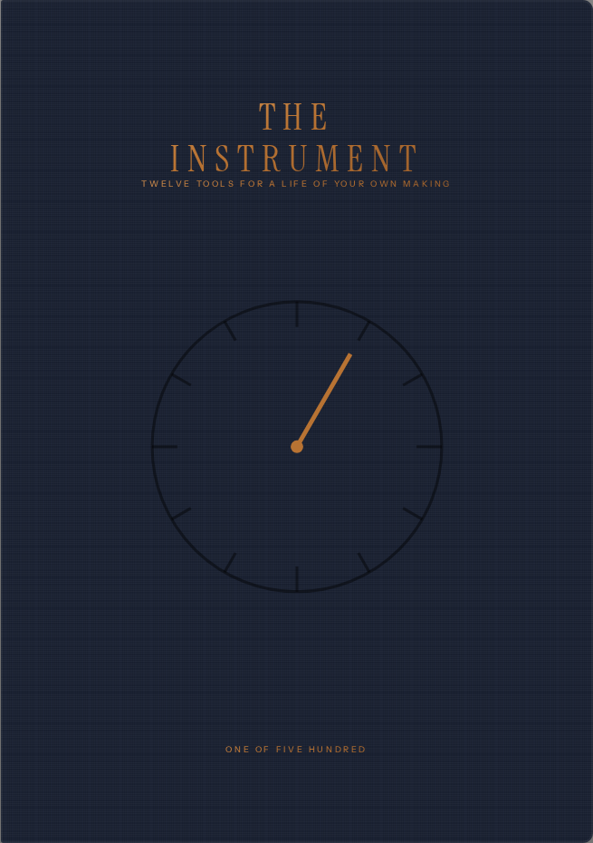
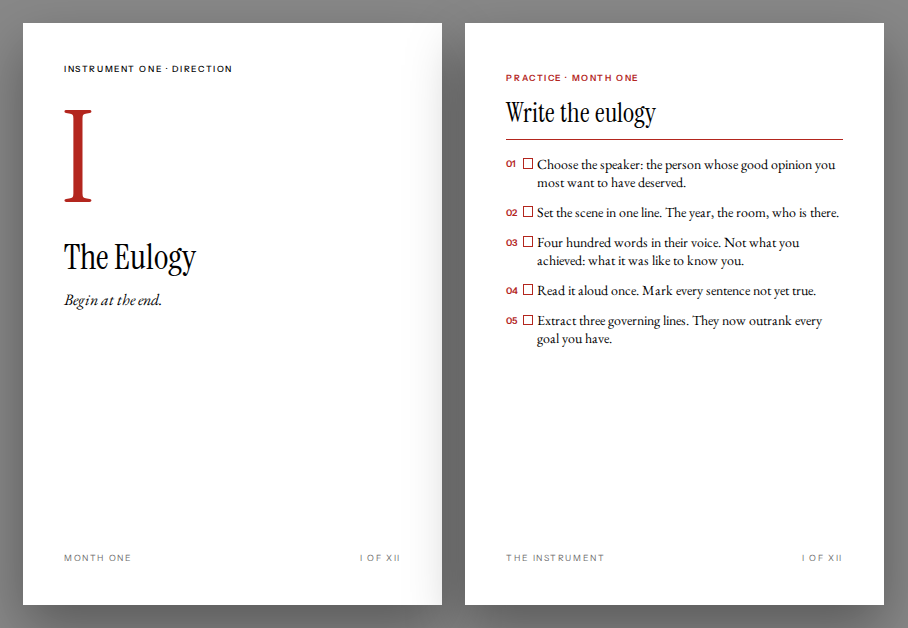

<p align="center"></p>

<h1 align="center">THE INSTRUMENT</h1>
<p align="center"><em>Twelve tools for a life of your own making</em><br>
A limited edition of 500 numbered copies · USD 250 · 96 pages · one year</p>

---

## The idea in five lines

1. **Most books do not change anyone**, because reading is passive and retention is near zero a month later. Everyone knows this; almost no book acts on it.
2. **The Instrument is not built to be read. It is built to be used**: twelve instruments, one a month, each with a twenty-minute chapter, a practice done by hand within the first week, and a ledger page you write on and sign.
3. **Every instrument is chosen on evidence** (named in the book, with what it does *not* prove) and every practice is small enough to survive contact with a real calendar.
4. **The object is a commitment device.** It is short so it can be re-read, numbered so it will be kept, signed by its owner at the end, and expensive so it will not be ignored. The price is part of the mechanism.
5. **It is made to be passed on.** The colophon has lines for the next owners. A sealed thirteenth chapter opens only after the vow is signed.

The word *instrument* carries three meanings and the book means all of them: a tool, a thing you practise, and a document with binding force.

## What is in the box

| # | Object | What it does |
|---|---|---|
| 1 | **The book** — 170 × 240 mm, 96 pp, two colours (black + cinnabar) on Munken Pure Rough 120 gsm, Smyth-sewn, cloth over boards, copper foil, printed endpapers, two ribbons | Twelve chapters. Each: an opener with a technical plate, a three-page essay ending in a thought experiment, a practice page facing a ledger page to write on. Plus a self-demonstrating opening test, the Year plan, the conclusion, the Vow, the Twelve Axioms, Notes & Sources, the Vocabulary, Acknowledgments, the colophon. |
| 2 | **The twelve cards** — A6, letterpress, two colours, cotton stock, plus a title card | Axiom on the front, the practice in brief on the back. Carried for the month. |
| 3 | **The Weeks Chart** — A2, two-colour litho, map-folded | 4,680 boxes, one per week of a ninety-year life, with the eightieth year marked. Filled in pen in month two. |
| 4 | **The Needle** — etched brass page-marker, stamped with the copy number | Marks the current month. The one singular object every $250+ edition has. |
| 5 | **The sealed envelope** — four A5 pages, wax-sealed | Chapter XIII. Opened after the vow, not before. |
| 6 | **The register** — a number, a date, twelve emails | Records when the owner's year began; sends one message on the first of each month with nothing in it but the instrument's name. Re-registered when the book is passed on. |
| — | **Cloth clamshell box**, hand-numbered and signed colophon, 500 copies + 12 *hors commerce* | |

Rendered proofs are in `book/dist/` — start with **`the-instrument.pdf`** (screen version with paper tint) and `the-instrument-PRINT.pdf` (bleed and crop marks).

<p align="center"></p>

## The twelve instruments

| | Instrument | Axiom | The practice (done by hand, first week of the month) |
|---|---|---|---|
| I | **The Eulogy** | Begin at the end. | Write your eulogy in someone else's voice; extract three governing lines that outrank every goal. |
| II | **The Weeks** | A life is four thousand weeks. Spend them on purpose. | Fill the Weeks Chart; run the tail-end sum for three people; set one weekly non-negotiable; cancel one recurrence. |
| III | **The Question** | The quality of a life follows the quality of its questions. | Fifty questions in one sitting; circle three that hurt; find the eigenquestion; carry it. |
| IV | **Inversion** | Avoid stupidity before you attempt brilliance. | Premortem the year's most important thing; fifteen causes; a kill criterion; a not-to-do list. |
| V | **Asymmetry** | Make many small bets whose downside is bounded and whose upside is not. | Sort every postponed decision by door and by asymmetry; place three bets; open a decision ledger. |
| VI | **The Loop** | You become whatever you get fast feedback on. | Measure the loop length of three skills; cut the longest by ten; run it thirty days; retrieve, don't re-read. |
| VII | **Attention** | Your experience is what you agree to attend to. | Three days in ten-minute boxes; two sacred hours daily, phone in another room; remove one input. |
| VIII | **Compounding** | Small, repeated, for years, beats large, occasional, for months. | Name one compounding asset; write the ten-year letter; set the weekly minimum. |
| IX | **Taste** | Quantity is the road to quality. | One hundred ideas; make and show one small thing a week; start a commonplace book; make/consume 1:1. |
| X | **The Ask** | Most of the world is a door that opens if you knock. | Five asks in seven days; the letter you've been not writing; collect ten refusals. |
| XI | **The Body** | The mind is something the body does. | Fourteen days of the four: fixed wake time, morning daylight, thirty minutes moving, five minutes of slow breathing. |
| XII | **The Others** | Good relationships keep us happier and healthier. Period. | Name the five; a gratitude letter read aloud in person; a weekly call for twelve weeks; repair one thing. |
| — | **The Vow** | | One implementation intention, signed and witnessed, reviewed quarterly. Then the envelope. |

Every chapter follows the same six-page rhythm, so the book teaches its own use: **opener | essay · essay | essay · practice | ledger**. The structure is enforced by the build, not by hand.

## What makes it different from a $20 book

- **Twelve plates.** Every opener carries a technical drawing of the instrument, in hairlines and one spot colour, captioned like a figure in a manual: the two regrets crossing, a habit as a column through the years, the Kelly curve and the survivable fraction, loop length on a log scale, attention residue across a day, the flat part of a compounding curve, the gap between taste and work, the bridge across a structural hole, the deficit you cannot feel. No stock illustration anywhere. They are inline SVG, drawn from the research they cite, and they are the book's visual signature.
- **Thirty-one named tools.** Governing lines, the column, the tail-end sum, the fifty, the kill criterion, the four failures, the asymmetry sort, three bankrolls, loop length, the loop ratio, the applause trap, the thousand minutes, the room rule, the closure line, the flat part, the compounding audit, the gap, the make/consume ratio, the bridge, collecting refusals, the four, the five, the small turn, and the rest. Each is introduced in an essay, used on a practice page, printed on a card, and defined on the Vocabulary page with credit where it is borrowed. Short words for long arguments.
- **Twelve thought experiments.** The stranger's eulogy (what would your calendar and bank statements say you loved?), the answered world (if any question could be answered in a second, what would still be scarce?), the saboteur, the thousand lives, the silent year, the invoice, the investor, the impaired judge. Each closes an essay with a scenario, a question and a turn.
- **A test on page eight.** Before the book begins, the reader is asked to write the three most useful ideas from the last serious book they finished. Most people cannot. The page is dated so that it can be re-taken a year later. The book's claim is tested by the book.
- **Evidence with its limits stated.** Every figure in the Notes was verified against the primary source; the Notes say what each study does not show; stories are labelled stories; the two most fashionable ideas in the genre are excluded with the meta-analyses that say why.
- **Unexpected connections.** A Bell Labs betting formula becomes a rule for sizing a life's risks in three bankrolls. A 1935 bomber crash and a 2009 surgical trial become one instrument. A sociologist's finding about job-hunting and a Stanford study of asking strangers for favours combine into a courage practice with a target number of refusals. A sleep-laboratory divergence between measured lapses and self-rated sleepiness becomes the reason the book tells you to decide once, in writing, rather than nightly.

## Why it is worth $250

**Because it is not a book. It is a year.** A reader pays for a twelve-month programme with physical commitment devices, not for 25,000 words. The nearest honest comparisons are a course or a coach, not a hardback.

**Because the price does work.** Gourville and Soman (*Harvard Business Review*, 2002) showed that people use what they have paid for in proportion to how vivid the payment is. Shiv, Carmon and Ariely (*Journal of Marketing Research*, 2005) showed that a discounted price measurably reduces performance with the same product. A $25 version of this book would be shelved. The book says so on page 9.

**Because the object earns it.** Research into what sells out at this price point (Folio Society, Suntup, Conversation Tree Press, Arion, Centipede) finds the same five things stacked every time: a signature with hand-numbering, a letterpress element, named craft partners in the colophon, a clamshell rather than a slipcase, and one singular object. The Instrument has all five.

**Because of what it sits beside.**

| Edition | Price | Run | What you get |
|---|---|---|---|
| Centipede Press, *Nightwings* (2025) | $125 | 500 signed | cloth, slipcase, ribbon, frontispiece |
| **The Instrument** | **$250** | **500 + 12 HC** | **book, clamshell, 12 letterpress cards, chart, brass needle, sealed chapter, register, signed and numbered** |
| Conversation Tree Press, *Foundation* Collector's | $285 | — | letterpress, Bradel binding, solander box with brass medallion (Deluxe) |
| Suntup Editions, Numbered state | ~$325 | 250 | letterpress, clamshell |
| Folio Society LE, *The Last Unicorn* (2025) | £500 / $705 | 500 | full leather, clamshell, letterpress label, signed |
| Arion Press, *Mrs. Dalloway* (2025) | $1,575 | 250 | letterpress on Mohawk Superfine, slipcase, original art |

**Because it is honest.** Every claim rests on named research with its limits stated, stories are labelled stories, and two fashionable ideas (grit, growth mindset) are left out on purpose with the meta-analyses that say why. Buyers at this price are not fooled by hype; they are persuaded by care.

## Unit economics (500 copies, estimates for a European craft trade house)

| Item | Per copy |
|---|---|
| Book: 96 pp, 2/2, Munken 120 gsm, sewn, cloth, foil + deboss, printed endpapers, 2 ribbons | $18 |
| Cloth clamshell box, foil numeral | $22 |
| Thirteen letterpress cards, two colours, cotton stock, belly band | $11 |
| Weeks Chart, A2 two-colour litho, map-fold | $2 |
| Sealed letter: A4 folded, Colorplan envelope, wax seal, hand-sealed | $2.50 |
| The Needle, etched brass, numbered | $8 |
| Numbering, signing, assembly, QA (15 min at $30/h) | $7.50 |
| Shipping carton, tissue, insert | $4 |
| Insured worldwide shipping, average | $22 |
| Payment processing, 3.5 % | $8.75 |
| **Cost of goods and delivery** | **≈ $106** |
| **Contribution per copy** | **≈ $144 (57 %)** |

Fixed costs: prepress, proofs and press check ≈ $2,500; foil and deboss dies plus letterpress plates ≈ $1,200; photography ≈ $1,500; register (a small web form and twelve scheduled emails) ≈ $1,500; permissions clearance ≈ $500; ISBN and legal ≈ $200; contingency ≈ $750. **Total ≈ $8,150.** Revenue on 500 copies is $125,000; contribution after fixed costs and the twelve HC copies is roughly **$62,000** before marketing. Break-even is under 60 copies. Sources for the cost ranges are in `PRODUCTION.md`.

## Launch plan (one page)

- **Waitlist first.** A single page: the cover, the five-line idea, the box contents, one spread, and a number. No price until the list is open.
- **Founders' 50.** Copies 1–50 ship first, with the founder's name printed in a bound-in letter. Same price. Scarcity inside scarcity.
- **The register as the funnel.** Twelve monthly emails to owners, each one word long, are the whole marketing after the sale. Owners post their ledgers. The chart photographs well.
- **One printing.** The colophon says it will not be reprinted in this form, and that must be true. A different form (a trade edition without the box, two years later) is the only acceptable follow-up, and the limited edition should be told so at launch.
- **Press.** The pitch is not "self-help". It is "a book that admits books don't work and is designed accordingly". That is a story a design or business editor can run.

## Repository

```
README.md            this prospectus
PRODUCTION.md        full manufacturing specification, materials, suppliers, BOM, QA checklist
LICENSE.md           rights: text and design reserved; tooling MIT; fonts OFL
book/
  build.mjs          build pipeline: assembles parts, pre-hyphenates, renders with Chromium + Paged.js
  package.json       npm run build  |  npm run build:book  |  npm run build:extras
  src/
    book.html        page template for the interior
    parts/           the manuscript, one file per section (00-front … 17-colophon)
    styles/          book.css (typography and page geometry), fonts.css
    fonts/           EB Garamond, Instrument Serif, Instrument Sans (OFL)
    cover.html       case-wrap mockup + stamping artwork
    cards.html       the twelve cards (26 pages, A6 + bleed)
    chart.html       the Weeks Chart (A2)
    letter.html      the sealed thirteenth chapter (4 × A5)
  dist/              rendered PDFs and PNG previews
```

**Build:** `cd book && npm install && npm run build`. Requires Node 22 and a Chromium reachable by Playwright. The interior is 96 pages (six 16-page signatures); the build prints the page count and will show any chapter that drifts off its six-page rhythm as a blank page in the map.

**Editing:** the text lives in `book/src/parts/*.html`. Each chapter's essay must fill exactly three pages; the practice must fit one. Change words, rebuild, check the count.

## Status

Done: concept, manuscript (about 28,000 words, every citation fact-checked against primary sources), twelve plates, twelve thought experiments, the vocabulary, full typographic design system with a single theme file, interior PDF (screen and print-ready with bleed), cover mockup and stamping artwork, the twelve cards, the Weeks Chart, the sealed letter, production specification, unit economics, and the working documents (CLAUDE.md, DESIGN.md, EDITING.md).

Before it goes to press:

1. Read the whole book once as a reader and once as an editor. It was written to be tightened, not padded.
2. Get three quotes against `PRODUCTION.md` (suggested: Smith Settle, Gomer Press, Memminger MedienCentrum; Replika or Pragati if the run moves to India) and a bulk sample to fix the spine width.
3. Clear the epigraph quotations (short, attributed; a permissions check is still due diligence at this price).
4. Confirm the imprint name. "Dic-c Editions" is a placeholder in the title page, the colophon and the cards.
5. Build the register (a form, a database with 512 rows, twelve scheduled emails).
6. Photograph the set. The cover mockup in this repository is a render, not a photograph.
